## Base de datos para empresa de tecnología

Se plantea la creación de una BBDD para una empresa de tecnología.
- Realiza la creación de la BBDD, creando las sentencias sql necesarias.
- Realiza la inserción de los valores.
- Realiza las siguientes consultas 
    - Averigua el DNI de todos los clientes.

    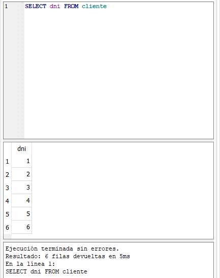

    - Consulta todos los datos de todos los programas.

    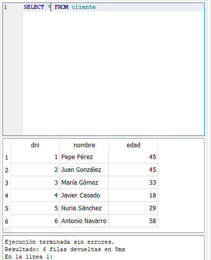

    - Obtén un listado con los nombres de todos los programas.

    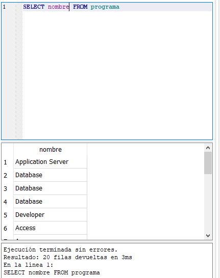

    - Genera una lista con todos los comercios.

    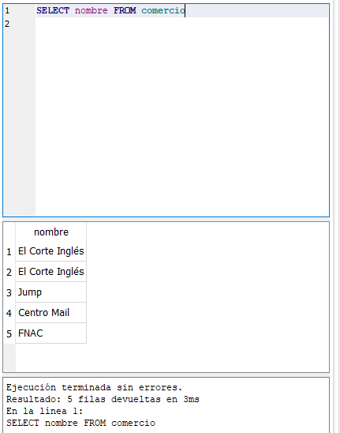

    - Genera una lista de las ciudades con establecimientos donde se venden programas, sin que aparezcan valores duplicados (utiliza DISTINCT).

    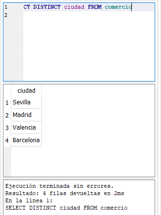

    - Obtén una lista con los nombres de programas, sin que aparezcan valores duplicados (utiliza DISTINCT).

    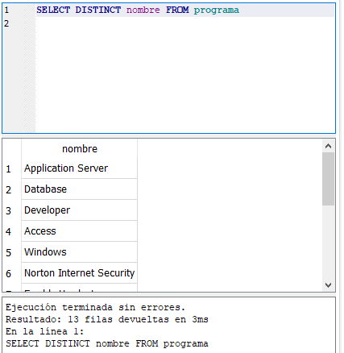

    - Obtén el DNI más 4 de todos los clientes.

    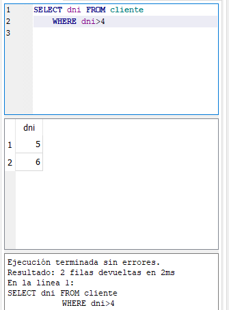

    - Haz un listado con los códigos de los programas multiplicados por 7. 9 ¿Cuáles son los programas cuyo código es inferior o igual a 10?

    - ¿Cuál es el programa cuyo código es 11?

    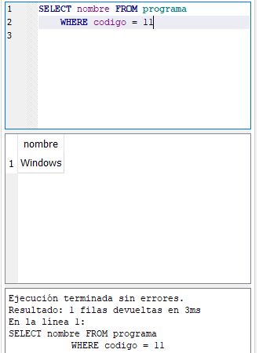

    - ¿Qué fabricantes son de Estados Unidos?

    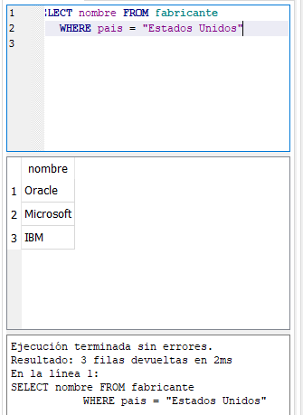

    - ¿Cuáles son los fabricantes no españoles? Utilizar el operador IN.

    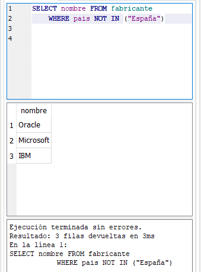

    - Obtén un listado con los códigos de las distintas versiones de Windows.

    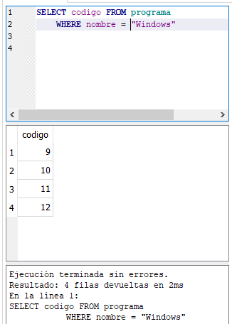

    - ¿En qué ciudades comercializa programas El Corte Inglés?

    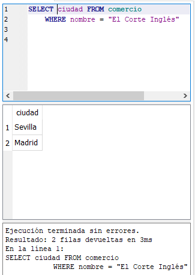

    - ¿Qué otros comercios hay, además de El Corte Inglés? Utilizar el 
    operador IN.

    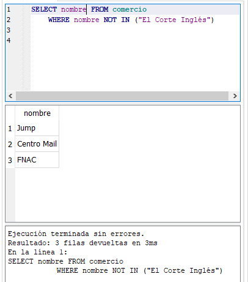

    - Genera una lista con los códigos de las distintas versiones de Windows y Access. Utilizar el operador IN.

    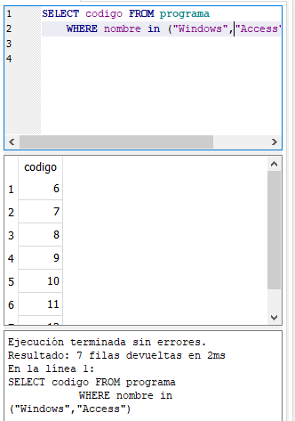

    - Obtén un listado que incluya los nombres de los clientes de edades comprendidas entre 10 y 25 y de los mayores de 50 años. Da una solución con BETWEEN y otra sin BETWEEN.

    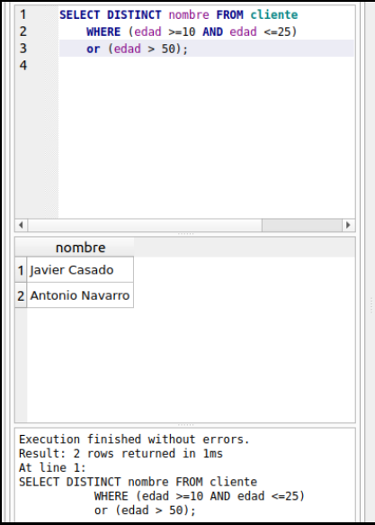

    - Saca un listado con los comercios de Sevilla y Madrid. No se admiten valores duplicados.

    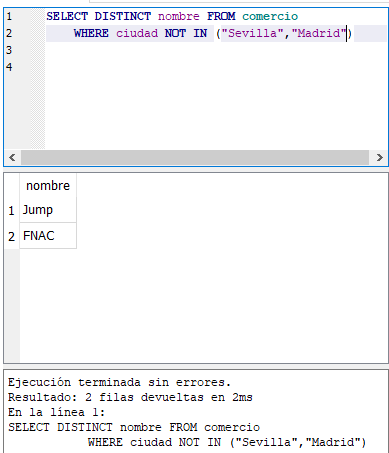

    - ¿Qué clientes terminan su nombre en la letra “o”?

    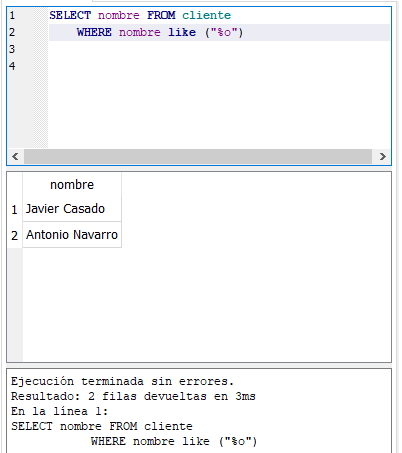

    - ¿Qué clientes terminan su nombre en la letra “o” y, además, son mayores de 30 años?

    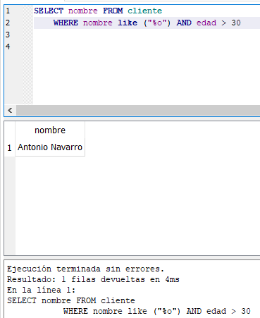

    - Obtén un listado en el que aparezcan los programas cuya versión finalice por una letra i, o cuyo nombre comience por una A o por una W.

    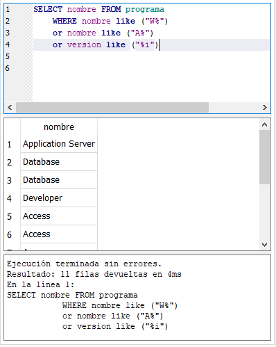

    - Obtén un listado en el que aparezcan los programas cuya versión finalice por una letra i, o cuyo nombre comience por una A y termine por una S.

    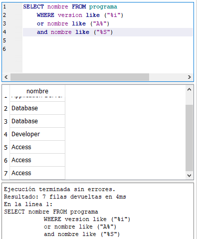

    - Obtén un listado en el que aparezcan los programas cuya versión finalice por una letra i, y cuyo nombre no comience por una A.

    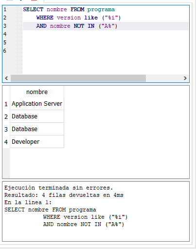

    - Obtén una lista de empresas por orden alfabético ascendente.

    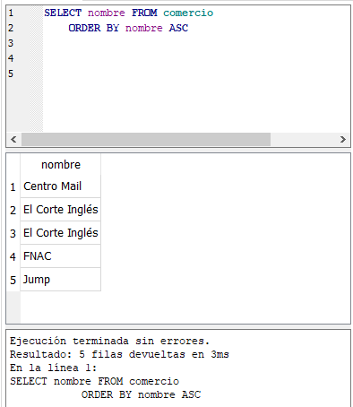

    - Genera un listado de empresas por orden alfabético descendente.

    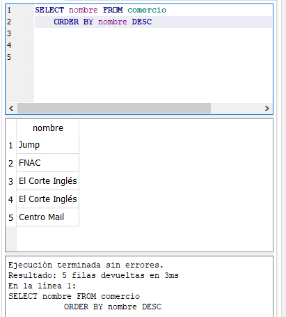

    - Obtén un listado de programas por orden de versión.

    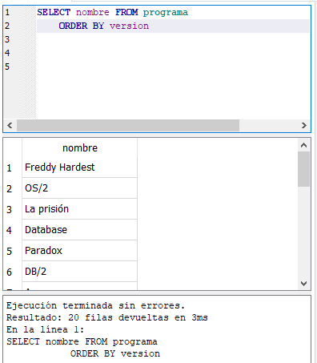

    - Genera un listado de los programas que desarrolla Oracle.

    

    - ¿Qué comercios distribuyen Windows?

    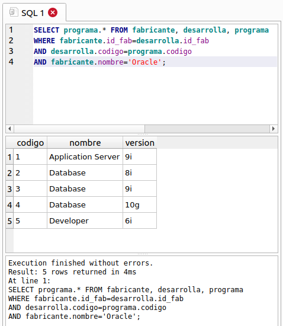

    - Genera un listado de los programas y cantidades que se han distribuido a El Corte Inglés de Madrid.

    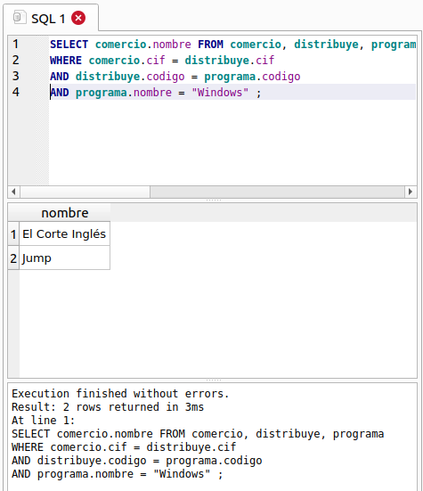

    - ¿Qué fabricante ha desarrollado Freddy Hardest?

    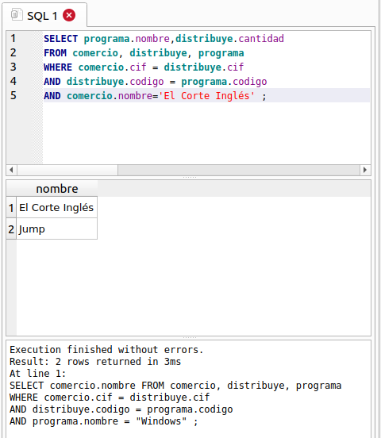

    - Selecciona el nombre de los programas que se registran por Internet.

    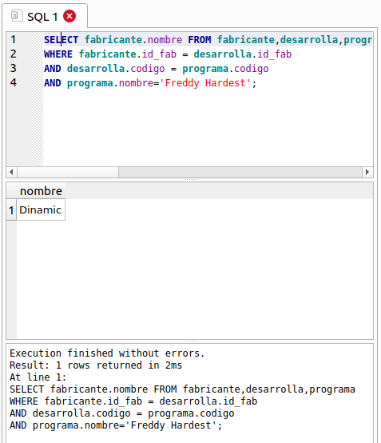

    - ¿Qué medios ha utilizado para registrarse Pepe Pérez?

    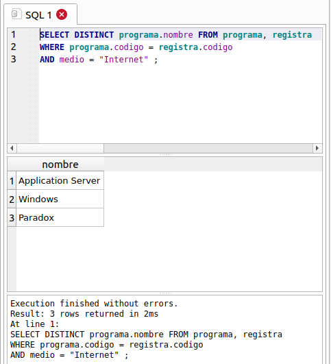

    - ¿Qué usuarios han optado por Internet como medio de registro?

    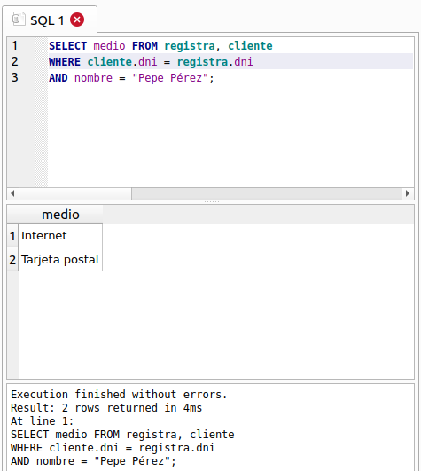

    - ¿Qué programas han recibido registros por tarjeta postal?

    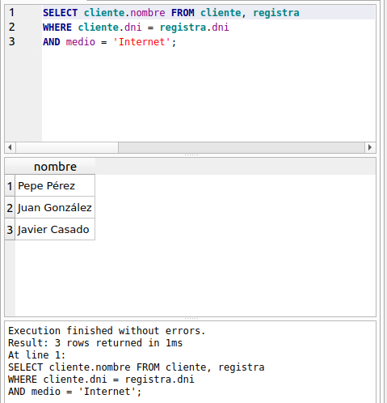

    - ¿En qué localidades se han vendido productos que se han registrado
    por Internet?

    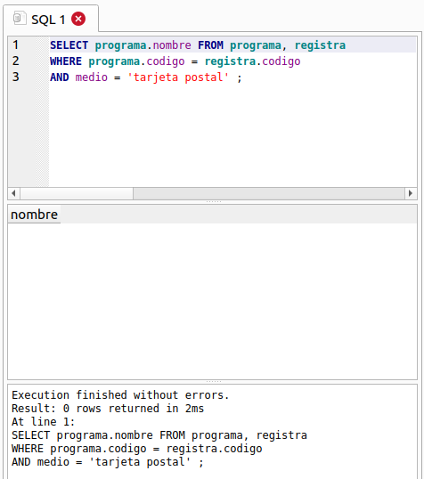

    - Obtén un listado de los nombres de las personas que se han registrado por Internet, junto al nombre de los programas para los que ha efectuado el registro.

    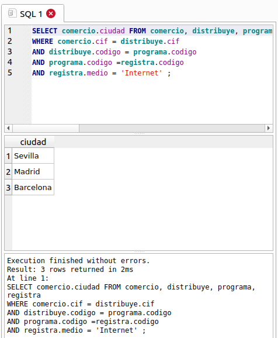

    - Genera un listado en el que aparezca cada cliente junto al programa que ha registrado, el medio con el que lo ha hecho y el comercio en el que lo ha adquirido.

    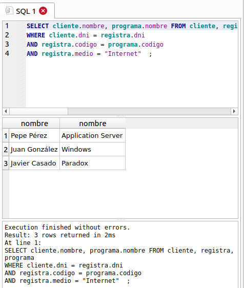

    - Genera un listado con las ciudades en las que se pueden obtener los productos de Oracle.

    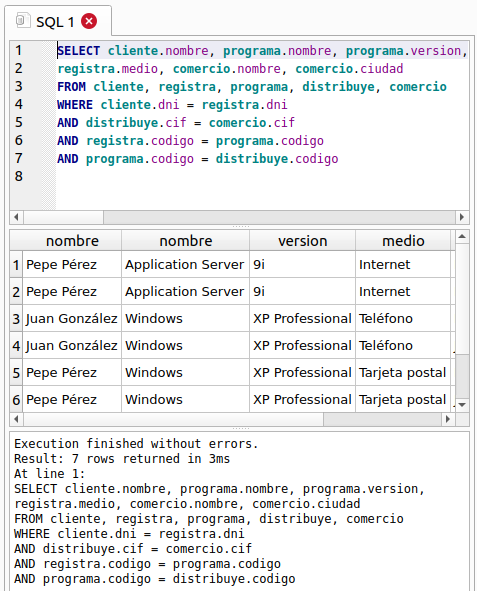

    - Obtén el nombre de los usuarios que han registrado Access XP.

    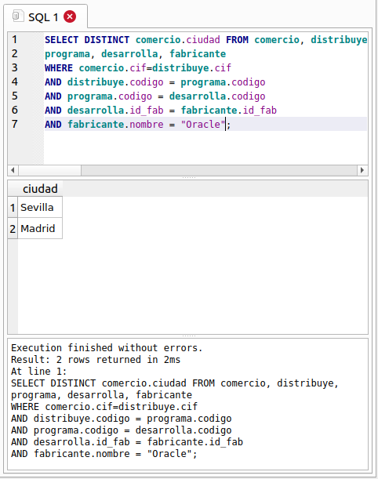

    - Nombre de aquellos fabricantes cuyo país es el mismo que ʻOracleʼ. (Subconsulta).

    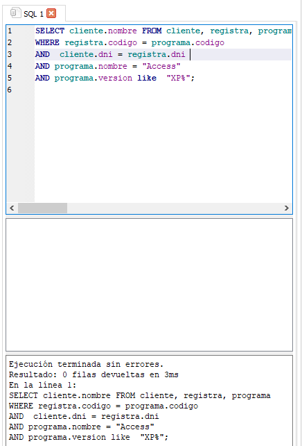

    - Nombre de aquellos clientes que tienen la misma edad que Pepe Pérez. (Subconsulta).

    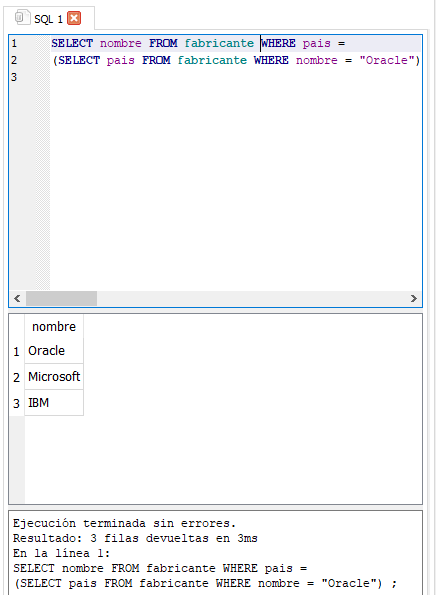

    - Genera un listado con los comercios que tienen su sede en la misma ciudad que tiene el comercio ʻFNACʼ. (Subconsulta).

    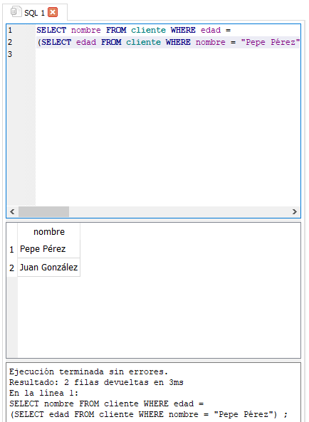

    - Nombre de aquellos clientes que han registrado un producto de la misma forma que el cliente ʻPepe Pérezʼ. (Subconsulta).

    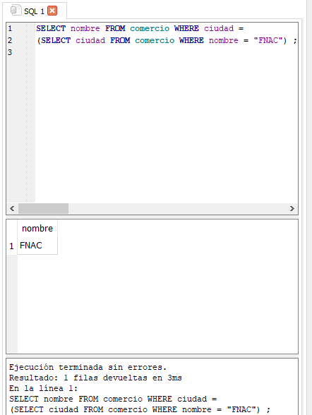

    - Obtener el número de programas que hay en la tabla programas. 46 Calcula el número de clientes cuya edad es mayor de 40 años.

    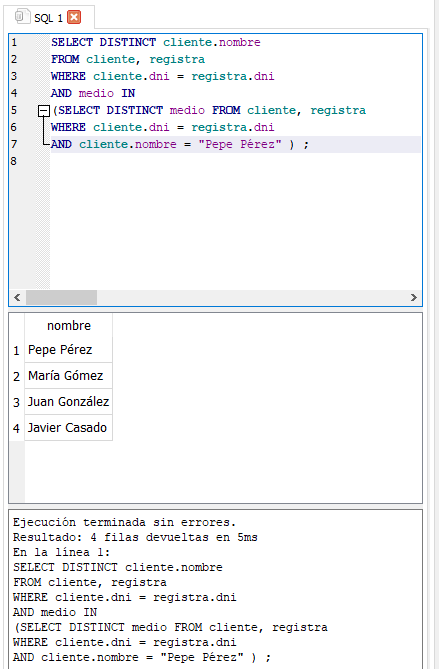

    - Calcula el número de productos que ha vendido el establecimiento cuyo CIF es 1.

    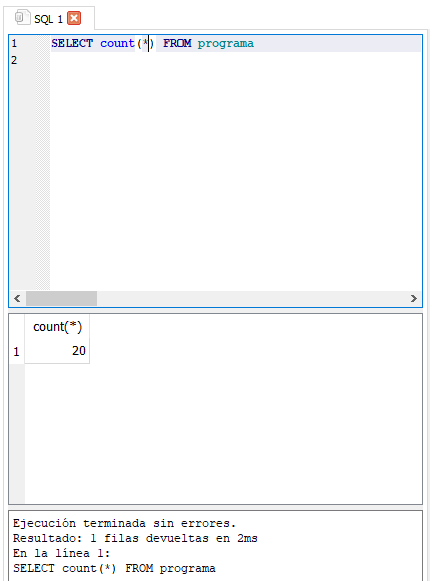

    - Calcula la media de programas que se venden cuyo código es 7.

    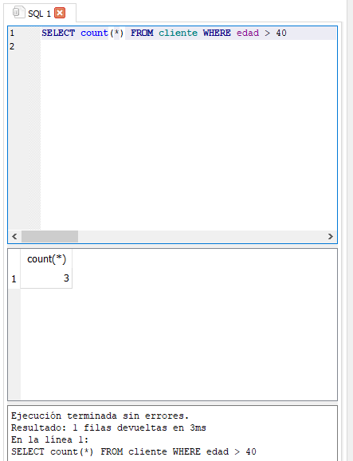

    - Calcula la mínima cantidad de programas de código 7 que se ha vendido.

    - Calcula la máxima cantidad de programas de código 7 que se ha vendido.

    - ¿En cuántos establecimientos se vende el programa cuyo código es 7?

    - Calcular el número de registros que se han realizado por Internet.

    - Obtener el número total de programas que se han vendido en ʻSevillaʼ.

    - Calcular el número total de programas que han desarrollado los fabricantes cuyo país es ʻEstados Unidosʼ.

    - Visualiza el nombre de todos los clientes en mayúscula. En el resultado de la consulta debe aparecer también la longitud de la cadena nombre.

    - Con una consulta concatena los campos nombre y versión de la tabla PROGRAMA.

